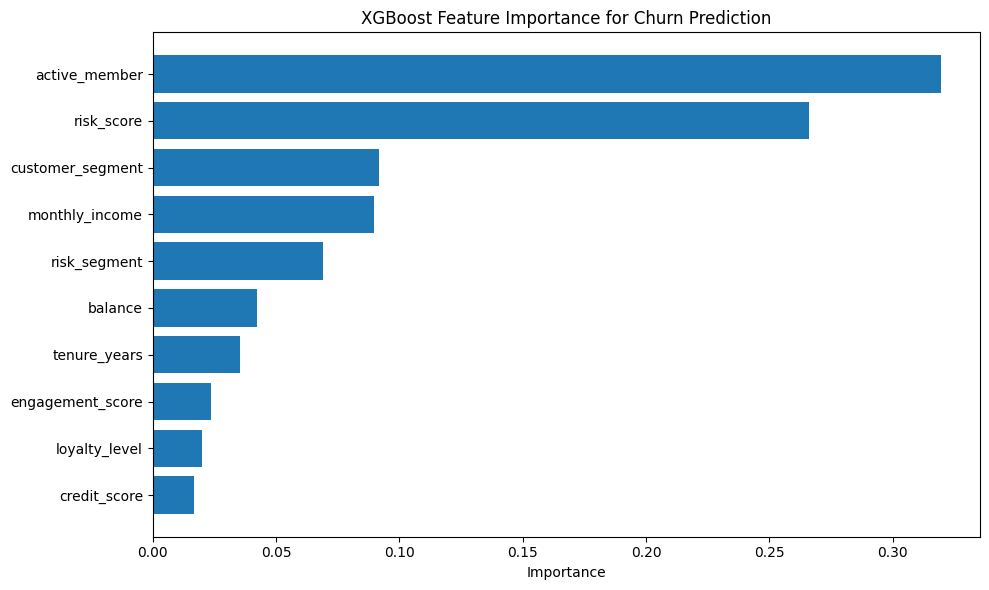
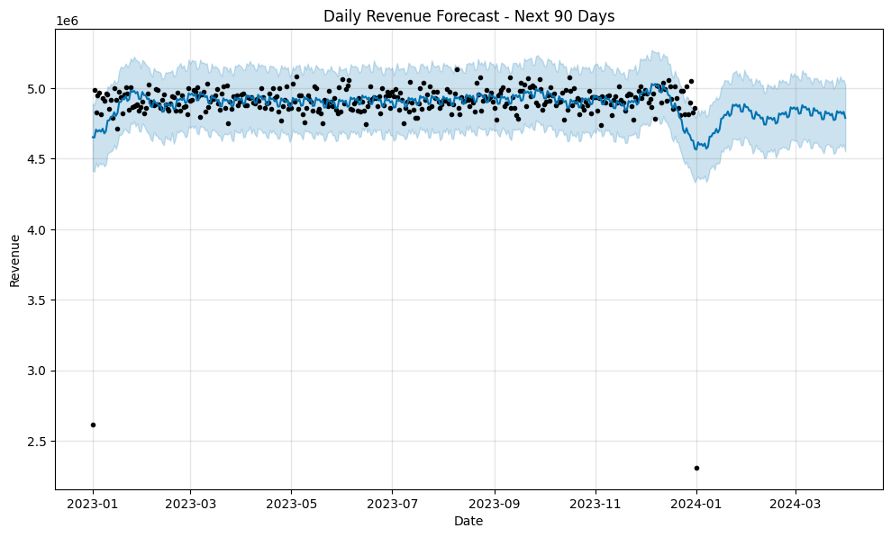

# 🏦 FinTech Intelligence Platform (FIP)

**End-to-end Data Analytics project for a digital bank / FinTech**  
*Churn prediction | Cash flow forecasting | Automated insights | Interactive dashboard*

---

## 📌 Project Overview

| Item | Description |
|------|-------------|
| **Goal** | Build an automated data platform that helps a FinTech company proactively identify customers at risk of churning, forecast cash flow, and generate daily business insights. |
| **Stack** | Google BigQuery (Data Warehouse), dbt (transformation), Airflow (orchestration), Power BI (dashboard), Ollama Cloud (AI insights) |
| **Architecture** | Medallion (Bronze → Silver → Gold) + Hybrid (local orchestration + cloud processing) |

## 📊 Dashboard Pages

| Page | Content |
|------|---------|
| **Page 1 – Executive Overview** | KPIs, Revenue trend + forecast, Revenue by segment | ➕ Added 90-day revenue forecast with confidence interval |
| **Page 2 – Customer Health** | Churn rate by loyalty level, risk segment, cluster group; Customer profile table; Segment slicer |
| **Page 3 – Churn Drivers** | Feature importance from XGBoost, Risk level KPI cards, Risk slicer | 🆕 ML-driven insights |
| **Page 4 – What-if Scenario** | Discount parameter slicer, projected revenue vs current revenue, revenue impact |
| **Page 5 – AI Insights** | Daily AI-generated business summary | 🆕 Powered by Ollama Cloud |


🔗 **[Live Dashboard](https://app.powerbi.com/links/-2dyE26wD7?ctid=246d1169-d80e-4f80-b3ff-c334c35a8798&pbi_source=linkShare)**

---

## 🎯 Business Problem & Analytical Framework

The project follows a **4‑level analytical framework**:

| Level | Question |
|-------|----------|
| **Descriptive** | Who is churning? |
| **Diagnostic** | Why are they churning? |
| **Predictive** | Who will churn next month? |
| **Prescriptive** | What actions to take? | 

**Key business metrics targeted:**  
- Reduce churn rate by 10–15%  
- Increase cash flow forecast accuracy >90%  
- Reduce ad‑hoc data question response time from 2 days to <2 minutes

---

## 📊 Data Sources & Medallion Architecture

### Bronze Layer (Raw data)

| Table | Source | Rows | Key columns |
|-------|--------|------|-------------|
| `bronze_customers` | Vietnam Bank Churn Dataset (Kaggle) | 80,000 | `id`, `exit` (churn label), `customer_segment`, `loyalty_level`, `risk_score` |
| `bronze_transactions` | Financial Transaction Fraud Dataset (Kaggle) | 5,000,000 | `transaction_id`, `amount`, `is_fraud`, `location`, `timestamp` |

### Silver Layer (Cleaned data) 

| Table | Description | Rows |
|-------|-------------|------|
| `stg_customers` | Cleaned customer data: renamed columns, filtered age 18-100, standardized data types | 80,000 |
| `stg_transactions` | Cleaned transaction data: converted timestamps, filtered amount > 0, fraud flags as integers | 5,000,000 |

**Staging models transform bronze → silver:**
- Rename columns for clarity (`credit_sco` → `credit_score`, `exit` → `churn_label`)
- Cast data types (`timestamp` string → `TIMESTAMP`, `is_fraud` boolean → `INT64`)
- Filter invalid records (age out of range, negative amounts, null timestamps)

### Gold Layer (Ready for BI) 

| Table | Type | Description | Rows |
|-------|------|-------------|------|
| `dim_customers` | Dimension | Customer attributes: age, segment, loyalty, risk, estimated LTV | 80,000 |
| `fct_daily_metrics` | Fact | Daily metrics joined with customer segments for filtering | 29.3M |
| `int_txn_daily_agg` | Intermediate | Daily transaction aggregation (revenue, count, avg amount) | 366 |
| `int_user_cohort` | Intermediate | Customer cohort preparation (last active month, months since last active) | 80,000 |

> 🧠 **Why Medallion?** This architecture ensures data quality at each stage, enables incremental processing, and creates a clear separation between raw, cleaned, and business‑ready data.

---

## 🔍 Initial Exploratory Data Analysis (EDA)

After uploading both tables to BigQuery, I performed initial quality checks and business‑focused analysis.

### 1. Data Quality Checks ✅

| Check | Result |
|-------|--------|
| Null values in key columns | ✅ 0% null (`age`, `exit`, `credit_sco`, `balance`, `engagement_score`) |
| Negative transaction amounts | ✅ 0 negative values |
| Fraud rate | 3.59% (179,553 / 5,000,000) – realistic for FinTech |

### 2. Customer Churn Insights (Descriptive Analysis)

**Overall churn rate: 18%** (14,400 / 80,000 customers)

#### Churn rate by customer segment

| Segment | Customers | Churn rate | Risk level |
|---------|-----------|------------|------------|
| **Mass** | 21,436 | **39.48%** | 🔴 High |
| Emerging | 31,662 | 17.62% | 🟡 Medium |
| Affluent | 11,210 | 3.10% | 🟢 Low |
| Priority | 15,692 | 0.07% | 🟢 Very low |

> 💡 **Key finding:** Mass segment has **13x higher churn rate** than Priority segment. This suggests current retention efforts may be over‑focused on VIP customers.

#### Churn rate by loyalty level

| Loyalty level | Customers | Churn rate | Insight |
|---------------|-----------|------------|---------|
| Bronze | 69,252 | 20.24% | Highest churn, largest group |
| Silver | 8,977 | 3.68% | Low churn |
| Gold | 1,771 | 2.82% | Lowest churn |

> 💡 **Key finding:** Loyalty level is a strong predictor of churn. Moving Bronze customers to Silver could significantly reduce churn.

#### Churn rate by risk segment

| Risk segment | Churn rate | Insight |
|--------------|------------|---------|
| Medium | **58.87%** | 🔴 Extremely high risk |
| Low | 15.13% | 🟡 Moderate |

> 💡 **Key finding:** `risk_score` (already provided in the dataset) is a powerful feature. Customers with `risk_segment = Medium` are almost 4x more likely to churn.

#### Churn rate by cluster group

| Cluster | Churn rate | Insight |
|---------|------------|---------|
| 1 | 22.25% | High churn |
| 2 | 22.17% | High churn |
| 4 | 0.05% | Almost no churn |
| 3 | 0.00% | Zero churn |

> 💡 **Key finding:** Clusters 3 and 4 are ideal customer profiles. Analyzing their characteristics will guide acquisition and retention strategies.

### 3. Customer Lifetime Value (LTV) – Roadmap

*Will be calculated in the Gold layer using:*
- **Monetary:** Average transaction amount × frequency
- **Recency:** Time since last active date
- **Tenure:** Customer age (from `created_date`)

> The Gold layer will include `dim_customers` with pre‑computed LTV segments (High, Medium, Low) for use in dashboard filters and targeting.

---

## 🧠 Hypotheses for Diagnostic Analysis (to test in Week 3‑4)

| Hypothesis | Test method | Data needed |
|------------|-------------|-------------|
| H1: Customers inactive for >30 days have much higher churn | Compare churn rate by `last_active_date` bucket | `last_active_date` |
| H2: Low `engagement_score` drives churn in Mass segment | Churn rate by engagement_score decile | `engagement_score` |
| H3: New customers (tenure <6 months) churn faster than older ones | Churn rate by `tenure_ye` | `tenure_ye` |
| H4: Fraud flags correlate with churn (false positives frustrate users) | Churn rate of customers with vs without fraud transactions | `is_fraud` + join |

---

## 🛠️ dbt Implementation

### What is dbt and why use it?

dbt (data build tool) transforms raw data in BigQuery using SQL, with software engineering best practices:
- **Version control** – All SQL transformations stored in Git
- **Modularity** – Reusable models (`staging` → `intermediate` → `gold`)
- **Testing** – Built-in data quality tests (not null, unique, accepted values)
- **Documentation** – Auto-generated data catalog

### Staging Models (Silver Layer)

| Model | Source | Transformations |
|-------|--------|-----------------|
| `stg_customers` | `bronze_customers` | Renamed columns, filtered age 18-100, standardized data types |
| `stg_transactions` | `bronze_transactions` | Converted timestamp string to TIMESTAMP, filtered amount > 0, fraud boolean → integer |


### Intermediate & Gold Models (Star Schema)

| Model | Type | Description |
|-------|------|-------------|
| `int_txn_daily_agg` | Intermediate | Daily revenue, transaction count, average amount |
| `int_user_cohort` | Intermediate | Cohort month and months since last active |
| `dim_customers` | Dimension (Gold) | Customer attributes: age, segment, loyalty, risk, estimated LTV |
| `fct_daily_metrics` | Fact (Gold) | Daily metrics joined with customer segments for filtering |

**Star Schema Lineage:**

```text
stg_customers ──► dim_customers (dimension)
       │
       └──────────────┐
                      ▼
stg_transactions ──► int_txn_daily_agg ──► fct_daily_metrics (fact)
                                               │
                                               ▼
                                        Power BI Dashboard
```

### dbt Project Structure
```
fintech_dbt/
├── models/
│   ├── staging/
│   │   ├── sources.yml          # Source declarations
│   │   ├── stg_customers.sql
│   │   └── stg_transactions.sql
│   ├── intermediate/
│   │   ├── int_txn_daily_agg.sql
│   │   └── int_user_cohort.sql
│   └── gold/
│       ├── dim_customers.sql
│       └── fct_daily_metrics.sql
├── tests/                       # Data quality tests
├── dbt_project.yml
└── README.md
```
## 🤖 Machine Learning

### 1. Churn Prediction Model (XGBoost)

**Objective:** Predict which customers are likely to churn in the next month.

**Model Performance:**
| Metric | Score |
|--------|-------|
| Accuracy | 83.84% |
| AUC-ROC | 85.59% |
| Precision | 60.15% |
| Recall | 30.24% |

> 📌 **Interpretation:** The model can distinguish between churn and non-churn customers with 85.6% accuracy (AUC-ROC). While recall is moderate (30%), this is typical for imbalanced churn data (only 18% churn rate).

#### Feature Importance – Top Drivers of Churn



| Rank | Feature | Importance | Business Insight |
|------|---------|------------|------------------|
| 1 | **`active_member`** | 31.9% | 🔴 **Most critical!** Inactive customers are far more likely to churn. |
| 2 | **`risk_score`** | 26.6% | 🔴 High credit risk → high churn probability. |
| 3 | **`customer_segment`** | 9.2% | Mass segment churns much more than Priority. |
| 4 | **`monthly_income`** | 9.0% | Lower income → higher churn. |
| 5 | **`risk_segment`** | 6.9% | Medium risk → higher churn than Low risk. |

> 💡 **Key Business Actions:**
> - **Active member** is #1 driver → launch weekly engagement campaigns (vouchers, loyalty points).
> - **Risk_score** is #2 → separate Medium risk group for special retention programs.
> - **Mass segment** has 39% churn rate → focus retention resources here.

#### Churn Predictions Summary

| Risk Level | Customers | % of Total | Action Required |
|------------|-----------|------------|-----------------|
| **High** (prob > 70%) | 1,493 | 1.9% | 🔴 Immediate intervention needed |
| **Medium** (30-70%) | 18,507 | 23.1% | 🟡 Monitor closely |
| **Low** (prob < 30%) | 60,000 | 75.0% | 🟢 Safe |

> 📌 **Total at-risk customers (Medium + High): ~20,000 (25%)** – a critical insight for retention strategy.

---

### 2. Revenue Forecasting (Prophet)

**Objective:** Forecast daily revenue for the next 90 days.



**Forecast Summary:**
- **Forecast period:** 90 days (Jan–Mar 2024)
- **Average daily revenue (forecast):** ~4.8 million VND/day
- **Confidence interval:** ±0.2 million VND (upper/lower bounds)

> 📌 **Key insight:** Revenue is projected to remain stable around 4.8M VND/day with minimal seasonal fluctuation in the next quarter.

## 🤖 AI Insights

Starting from Week 6, the dashboard includes **AI-generated daily insights** powered by **Ollama Cloud**.

### How it works:
1. **KPI Extraction:** A Python script runs daily to fetch key metrics from BigQuery (e.g., high-risk customers, churn rate, revenue).
2. **AI Generation:** The data is sent to Ollama Cloud (GPT-OSS model) which generates a structured business summary in Vietnamese.
3. **Dashboard Display:** The insight is stored in BigQuery and displayed on the **AI Insights** page of the Power BI dashboard.

### Sample Insight (translated):

> 📊 **General Situation:** Currently, there are 1,493 High-Risk customers (1.9%) and 18,507 Medium-Risk customers (23.1%). The average churn rate is 18.00%.  
> ⚠️ **Notable Points:** Mass segment customers have a churn rate of 39.48%, 13 times higher than Priority segment.  
> 💡 **Recommendations:** Focus retention campaigns on Mass and High-Risk segments. Send 10% discount vouchers to High-Risk customers. Monitor Medium-Risk group closely over the next 30 days.

### Dashboard Page:
- The AI Insight is displayed on a dedicated **"AI Insights"** page using the **HTML Content** visual for clean, modern formatting.
- The page automatically refreshes when new data is added to BigQuery.

> 💡 **Key Takeaway:** This feature demonstrates the ability to combine **traditional BI** with **Generative AI** to create a proactive, insight-driven decision-making tool.

### 🛠️ Technology Stack & Architecture
```
[Data Sources]
   ├── Kaggle datasets (CSV)
   └── Synthetic transaction generator (Python / Faker)
         │
         ▼
[Google Cloud Platform]
   ├── Cloud Storage → staging area
   ├── BigQuery → Data Warehouse
   │   ├── fip_dwh (Bronze)
   │   ├── fip_dwh_silver (Silver)
   │   └── fip_dwh_gold (Gold - Star Schema)
   └── (Week 4) Cloud Run Jobs → dbt & Python scripts
         │
         ▼
[Orchestration] (Week 5‑6)
   └── Airflow (local) or Cloud Scheduler → trigger dbt + ML pipelines
         │
         ▼
[BI & Insights]
   ├── Power BI Service → interactive dashboard (4 pages)
   └── Ollama Cloud → AI‑generated daily insights
```
